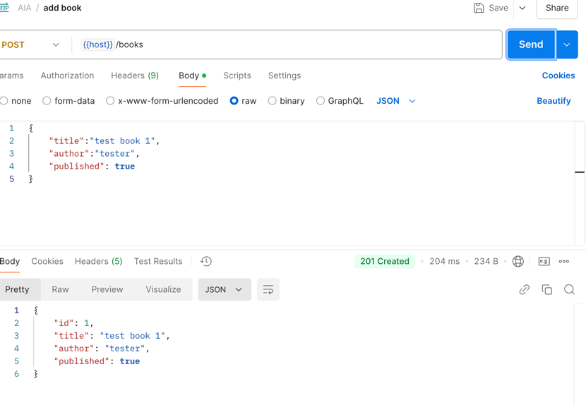

### How to Run
1. Create a database named `books` in MySQL.
2. Update `application.yml` with your MySQL url, username and password.
3. Run `mvn flyway:migrate` to create table
4. Run application `mvn clean install` and `mvn spring-boot:run`.
5. Run test `mvn test`.
---

### ScreenShots
#### 1. Add Book

#### 2. Book List

#### 3. Book List Filter By "published"

#### 4. Delete Book

#### 5. Update Book

#### 6. Add Book, Error: title is required

#### 7. Delete Book, Error: book not found

